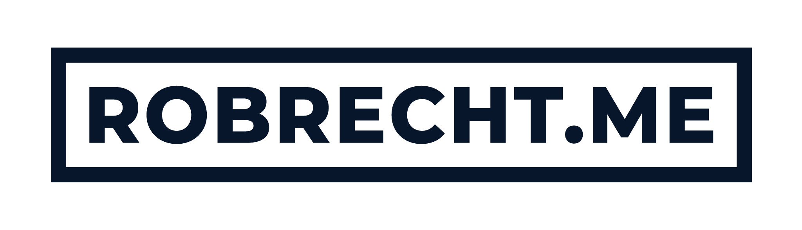

<div id="top"></div>

<!-- PROJECT LOGO -->
<br />
<div align="center">
  <a href="https://robrecht.me">
    
  </a>

  <p align="center">
    Personal website of Robrecht Meersman.
    <br />
    <a href="https://robrecht.me"><strong>View live »</strong></a>
    <br />
    <br />
    <a href="https://github.com/robrechtme/robrecht.me/issues">Report Bug</a>
    ·
    <a href="https://github.com/robrechtme/robrecht.me/issues">Request Feature</a>
  </p>
</div>

<!-- ABOUT THE PROJECT -->

## About The Project

[![robrecht.me personal website screenshot][product-screenshot]](https://robrecht.me)

Hi! Welcome to the source code of my personal website. This repo is not really meant for contributing, just to show off my source code. Open sourcing it also helps me keeping it clean and up-to-date!

### Built With

- [Next.js](https://nextjs.org/) - JavaScript framework
- [TailwindCSS](https://tailwindcss.com/) - CSS framework
- [DatoCMS](https://www.datocms.com/) - Headless CMS
- [Framer Motion](https://www.framer.com/motion/) - React animation framework
- [Cookie Though](https://cookiethough.dev/) - Cookie consent library

<!-- GETTING STARTED -->

## Getting Started

To get a local copy up and running, follow these simple steps.

### Prerequisites

This is an example of how to list things you need to use the software and how to install them.

- node@14
- yarn

### Installation

1. Clone the repo
   ```sh
   git clone https://github.com/robrechtme/robrecht.me.git
   cd robrecht.me
   ```
2. Install NPM packages
   ```sh
   yarn
   ```
3. Copy `.env.example` to `.env.local` and fill it in with your environment variables.
   ```sh
   cp .env.example .env.local
   ```
4. Start the dev server and go to http://localhost:3000 🎉
   ```sh
   yarn dev
   ```

<!-- LICENSE -->

## License

This repo does not have a license on purpose. See [No License](https://choosealicense.com/no-permission/) for more information. No touch, only look.

<!-- CONTACT -->

## Contact

Robrecht Meersman - [@robrechtme](https://twitter.com/robrechtme) - hello@robrecht.me

<!-- MARKDOWN LINKS & IMAGES -->
<!-- https://www.markdownguide.org/basic-syntax/#reference-style-links -->

[contributors-shield]: https://img.shields.io/github/contributors/robrechtme/robrecht.me.svg?style=for-the-badge
[contributors-url]: https://github.com/robrechtme/robrecht.me/graphs/contributors
[forks-shield]: https://img.shields.io/github/forks/robrechtme/robrecht.me.svg?style=for-the-badge
[forks-url]: https://github.com/robrechtme/robrecht.me/network/members
[stars-shield]: https://img.shields.io/github/stars/robrechtme/robrecht.me.svg?style=for-the-badge
[stars-url]: https://github.com/robrechtme/robrecht.me/stargazers
[issues-shield]: https://img.shields.io/github/issues/robrechtme/robrecht.me.svg?style=for-the-badge
[issues-url]: https://github.com/robrechtme/robrecht.me/issues
[linkedin-shield]: https://img.shields.io/badge/-LinkedIn-black.svg?style=for-the-badge&logo=linkedin&colorB=555
[linkedin-url]: https://linkedin.com/in/robrechtme
[product-screenshot]: images/screenshot.png
